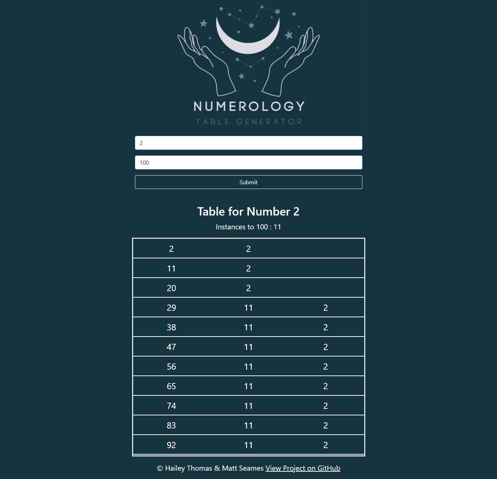

# Numerology Table Generator 🔢

## Description

 

I developed this project as a gift to my friend who is a Numerology wizard to help him out while he is doing his wizard things. ✨

## Table of Contents

- [Usage](#usage)
- [Development](#development)
- [Credits](#credits)
- [License](#license)

## Usage

- Select or enter in your main starting number from 1-9
- Select or enter in the max number of instances you would like
- Click the Submit bar and a table will generate of your main starting number + 9, iterated through to your max number. If the number is greater than your main number it will break down the number, add them together and print the results until it reaches your main number.

### Screenshot

### Links

- [https://haileythomas.github.io/numerology/](https://haileythomas.github.io/numerology/) - link to deployed website
- [https://github.com/HaileyThomas/numerology](https://github.com/HaileyThomas/numerology) - link to GitHub project

## Development

### Future Development

- Add ability to search multiple times without refresh
- Refactor code and break up into smaller functions

## Credits

  

## License

[License](https://opensource.org/licenses/MIT) - link to license

MIT License

Copyright (c) [2022] [Hailey Thomas]

Permission is hereby granted, free of charge, to any person obtaining a copy
of this software and associated documentation files (the "Software"), to deal
in the Software without restriction, including without limitation the rights
to use, copy, modify, merge, publish, distribute, sublicense, and/or sell
copies of the Software, and to permit persons to whom the Software is
furnished to do so, subject to the following conditions:

The above copyright notice and this permission notice shall be included in all
copies or substantial portions of the Software.

THE SOFTWARE IS PROVIDED "AS IS", WITHOUT WARRANTY OF ANY KIND, EXPRESS OR
IMPLIED, INCLUDING BUT NOT LIMITED TO THE WARRANTIES OF MERCHANTABILITY,
FITNESS FOR A PARTICULAR PURPOSE AND NONINFRINGEMENT. IN NO EVENT SHALL THE
AUTHORS OR COPYRIGHT HOLDERS BE LIABLE FOR ANY CLAIM, DAMAGES OR OTHER
LIABILITY, WHETHER IN AN ACTION OF CONTRACT, TORT OR OTHERWISE, ARISING FROM,
OUT OF OR IN CONNECTION WITH THE SOFTWARE OR THE USE OR OTHER DEALINGS IN THE
SOFTWARE.

## Questions

Please feel free to contact me below if you have any questions!

### Contact

-  -[mailto:haileyraethomas@gmail.com](mailto:haileyraethomas@gmail.com)
-  - [https://github.com/HaileyThomas](https://github.com/HaileyThomas)
